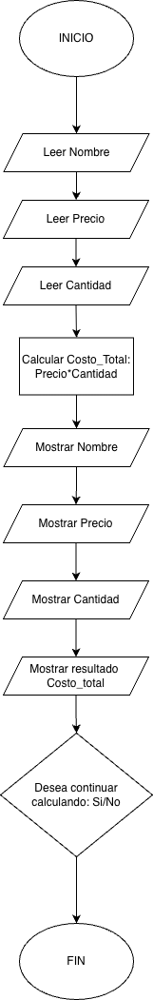

# Sistema de Ingreso de Datos en Inventario: H1 W1

## Descripción
Este es un programa sencillo en Python que permite al usuario ingresar información de productos en un inventario.  
El sistema valida los datos ingresados, calcula el costo total de cada producto y permite seguir agregando productos hasta que el usuario decida finalizar.

---

##  ¿Cómo funciona?
El programa se ejecuta en un ciclo y realiza los siguientes pasos:

1. **Ingreso del nombre del producto**
   - Solo permite letras y espacios.
   - No puede estar vacío.

2. **Ingreso del precio del producto**
   - Debe ser un número positivo.
   - Acepta coma `,` o punto `.` como separador decimal.

3. **Ingreso de la cantidad del producto**
   - Debe ser un número entero positivo.
   - No puede ser cero.

4. **Cálculo del costo total**
   - Se multiplica: precio × cantidad.

5. **Mostrar resultados**
   - Se muestran nombre, precio, cantidad y costo total.

6. **Opción de continuar**
   - El usuario decide si desea ingresar otro producto (`yes/no`).

---

## Flujo del programa
A continuación se muestra el diagrama de flujo que representa el funcionamiento del sistema:



---

##  Características
- Validación de entradas en todos los campos
- Manejo de errores con mensajes claros
- Permite ingresar múltiples productos
- Interacción sencilla con el usuario

---

## ¿Cómo ejecutar?
1. Asegúrate de tener Python instalado.
2. Ejecuta el archivo desde la terminal o tu IDE:

```bash
python3 inventario.py
```
